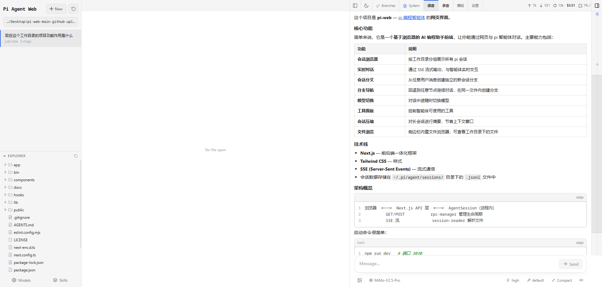
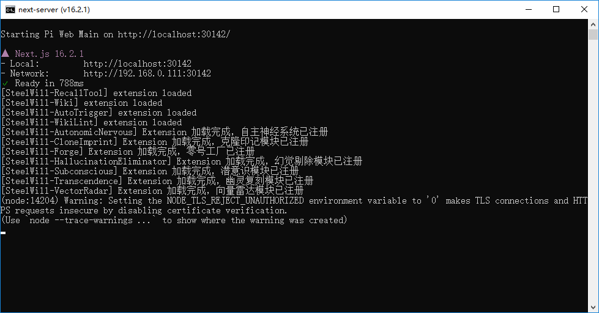

# Pi Agent WebUI

这是基于原版 `@agegr/pi-web` 改造后的 **Pi Agent WebUI**，重点是把原本偏“聊天查看”的界面，升级成更适合长期使用的“文件编辑 + 右侧对话协作”工作流。

[English README](./README.md)

## 项目概览

这份改造版把原版的布局：

- 左侧栏
- 中间聊天区
- 右侧文件预览区

改成了：

- 左侧栏：会话与文件树
- **中间：文件编辑主工作区**
- **右侧：聊天交互区**

并且新增了直接编辑文件、自动保存、文件写回接口、内置中文语音交互等能力。

## 截图

### 主界面



### 启动控制台



## 相比原版新增的核心功能

### 1. 新布局
- 左侧栏保留项目、会话、文件树导航。
- 中间改成文件编辑区。
- 右侧改成聊天协作区。

### 2. 直接编辑文件
- 文本文件默认直接进入编辑状态。
- 支持 `保存 / 放弃修改 / 自动保存`。
- 支持 `Ctrl+S / Cmd+S`。
- 文件 API 已支持 `PUT` 写回。

### 3. 内置中文语音能力
- 不再依赖浏览器插件。
- 在聊天区顶部直接内置中文语音控制：
  - `语音`
  - `录音`
  - `播报`
  - `设置`
- 支持浏览器原生语音识别和语音播报。
- 支持按住说话、实时识别气泡、延时自动发送、取消自动发送后保留到输入框。

### 4. 更实用的播报体验
- 播报前会清洗 Markdown 噪音。
- 尽量避免机械朗读大段代码块和格式符号。
- 默认语速已提升到 `1.8`。

## 运行环境说明

### 依赖
这次改造没有额外增加新的第三方语音 npm 包。

语音能力依赖浏览器原生 API：
- `SpeechRecognition / webkitSpeechRecognition`
- `speechSynthesis`

推荐浏览器：
- Chrome
- Edge

首次使用语音功能需要允许麦克风权限。

## 安装与运行

### 1. 克隆你的 GitHub 仓库

```bash
git clone https://github.com/ip9988001/Pi-Agent-Webui.git
cd Pi-Agent-Webui
```

### 2. 安装依赖

```bash
npm install
```

### 3. 开发模式运行

```bash
npm run dev
```

默认开发地址：

```text
http://localhost:30141
```

### 4. 生产构建

```bash
npm run build
```

### 5. 启动生产模式

```bash
npm start
```

## 目录结构

```text
app/
  api/
components/
hooks/
lib/
public/
docs/
```

## 这次重点改过的文件

- `components/AppShell.tsx`
- `components/ChatInput.tsx`
- `components/ChatWindow.tsx`
- `components/FileViewer.tsx`
- `components/VoiceControls.tsx`
- `hooks/useVoiceChat.ts`
- `app/api/files/[...path]/route.ts`
- `app/page.tsx`
- `package.json`

详细说明可继续看：

- [改造说明](./docs/CUSTOMIZATION_NOTES.zh-CN.md)
- [改动文件清单](./docs/CHANGED_FILES.zh-CN.md)
- [上传清单](./docs/UPLOAD_GUIDE.zh-CN.md)

## 上传到 GitHub 时不要提交

- `.next/`
- `node_modules/`
- `.codegraph/`
- `*.log`
- `tsconfig.tsbuildinfo`

## 许可证

MIT
